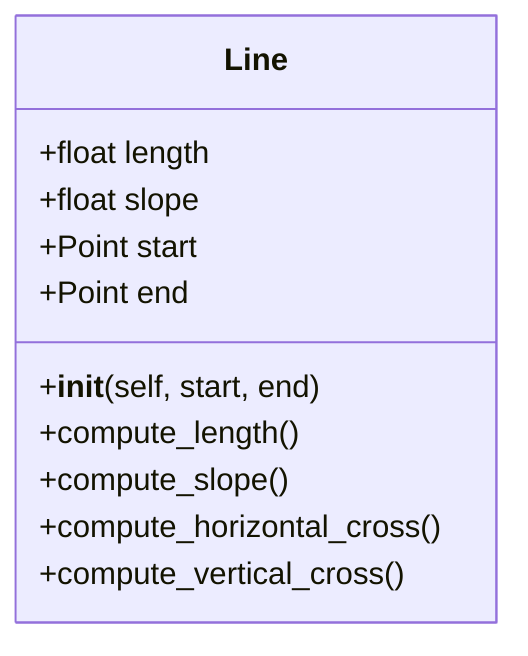
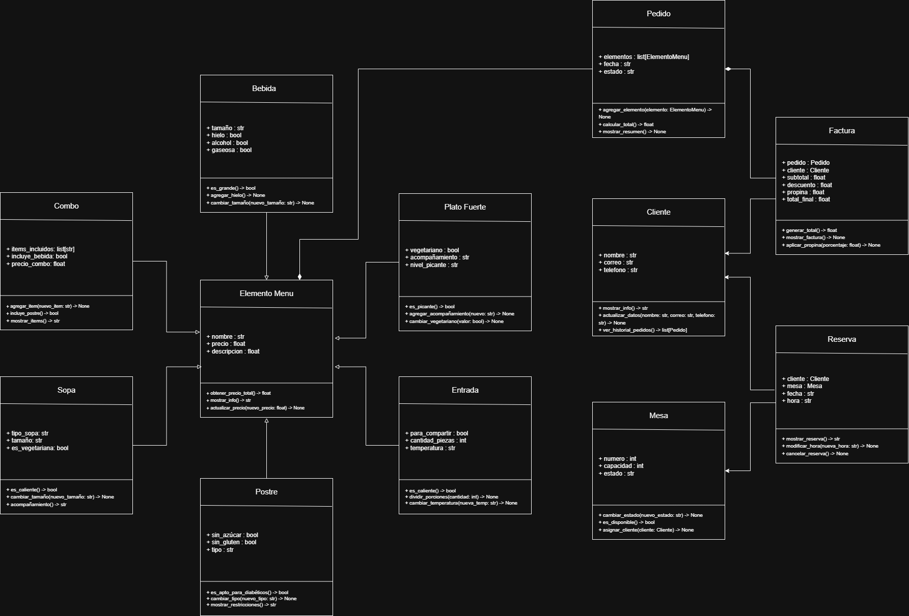
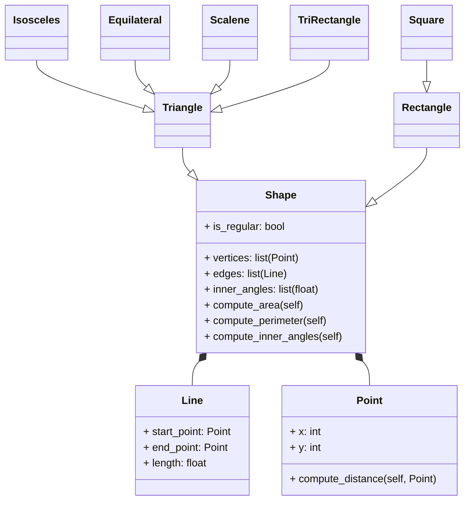

# Tabla de Contenidos
- [Introducción](#introducción)
- [Reto 1](#reto-1)
- [Reto 2](#reto-2)
- [Reto 3](#reto-3)
- [Reto 4](#reto-4) 
# Introducción
Este es mi primer repositorio, y lo estoy utilizando para aprender a documentar, organizar y compartir mi trabajo de forma profesional. Reúne los ejercicios y retos que he desarrollado durante mis clases de Programación Orientada a Objetos (POO) con el profesor Felipe y seguiré actualizándolo con nuevos retos a medida que avance en mi aprendizaje.
# Reto 1
En el reto 1 nos piden desarrollar una serie de ejercicios prácticos en Python, cada uno como un programa independiente. Los ejercicios incluyen operaciones matemáticas básicas entre dos números, verificación de palíndromos sin usar slicing, filtrado de números primos desde una lista, cálculo de la mayor suma entre elementos consecutivos, y detección de palabras que comparten los mismos caracteres. La idea es aplicar funciones, condicionales y lógica básica para resolver cada problema.
## 1.1
Crear una función que realice operaciones básicas (suma, resta, multiplicación, división) entre dos números, según la elección del usuario, la forma de entrada de la función será los dos operandos y el caracter usado para la operación. entrada: `(1,2,"+")`, salida `(3)`.
### Codigo
```python
print("Bienvenido, este programa te ayuda a hacer operaciones basicas.")
def operar(num_1, num_2, operador):
    if operador == "+":
        return num_1 + num_2
    elif operador == "-":
        return num_1 - num_2
    elif operador == "*":
        return num_1 * num_2
    elif operador == "/":
        if num_2 != 0:
            return num_1 / num_2
        else:
            return "No se puede dividir por 0."
    else:
        return "El operador que escribiste no es valido."
num_1 = float(input("Ingresa el primer numero (puede tener decimales): "))
num_2 = float(input("Ingresa el segundo numero (puede tener decimales): "))
operador = input("Ingresa el operador basico que quieras (+, -, *, /): ")
resultado = operar(num_1, num_2, operador)
print(resultado)


```
[Función que realiza operaciones básicas](Reto1/Reto1_1.py)
### ¿Cómo llegué al resultado
En este punto nos piden que realicemos una función donde el usuario introduzca sus propios datos, es decir, `num_1`, `num__2` y `operador`; para esto lo primero que hice fue definir la función `def operar` con sus 3 variables y para que se cumpla alguna de las tres operaciones hacer unas condicionales `if`, `elif` y `else`, que sirven para comparar y ver que operación se quiere realizar, y si se escribe un caracter diferente a los pedidos se da el error de que no ingreso uno válido. Después de esto, coloque un `input` para obtener los tres datos y un `print` para que muestre la operación al final.
## 1.2
Realice una función que permita validar si una palabra es un palíndromo. Condición: No se vale hacer slicing para invertir la palabra y verificar que sea igual a la original.
### Codigo
```python
print("Bienvenido, este programa sirve para conocer si la palabra que ingresas es un palindromo.")
def es_palindromo(palabra):
    i: int = 0
    j: int = len(palabra) - 1
    palindromo: bool = True

    while i < j:
        if palabra[i] != palabra[j]:
            palindromo = False
            break
        i += 1
        j -= 1

    return palindromo
palabra = input("Ingresa una palabra: ")
if es_palindromo(palabra):
    print("Si es un palindromo.")
else:
    print("No es un palindromo.")
```
[Función que valida si es un palíndromo](Reto1/Reto1_2.py)
### ¿Cómo llegué al resultado?
En este punto nos piden hacer una función que permita revisar si la palabra que introduzca el usuario es un palíndromo o no, para empezar ni siquiera sabia que era slicing así que no me parecio algo del otro mundo no usarlo, empece definiendo la función `def es_palindromo`, dentro de esta función hay una variable en `str` llamada `palabra`, también dos `int` que nos ayudarán luego para el ciclo que use, y por último una variable en `bool` que esta en `True`, luego de esto dos variables en `int` y una función llamada `len` que permite ver cuántos elementos hay en una secuencia. Luego de esto el ciclo `while` acompañado por un `if` nos permite recorrer el string por cada una de sus letras para asi corroborar si son iguales o no. Si son iguales la variable en `bool` sigue en `True` y nos muestra que la palabra que ingreso el usuario si es un palíndromo, y si el ciclo detecta que la palabra no es igual en alguna letra pues la variable `palabra` se convierte en `False` y nos saca del ciclo para dar el mensaje de que no es palíndromo. (Si se escribe la primera letra en mayuscula no lo toma como palíndromo).
## 1.3
Escribir una función que reciba una lista de números y devuelva solo aquellos que son primos. La función debe recibir una lista de enteros y retornar solo aquellos que sean primos.
### Codigo
```python
print("Bienvenido, este programa sirve para conocer si el numero que ingresas es un numero primo.")
numeros: str 
numeros_texto: list[str] = []
lista_numeros: list[float] = []
primos: list[int] = []

def es_primo(n: int) -> bool:
    if n < 2:
        return False
    for i in range(2, int(n**0.5) + 1):
        if n % i == 0:
            return False
    return True

def filtrar_primos(lista: list[int]) -> list[int]:
    resultado: list[int] = []
    for numero in lista:
        if es_primo(numero):
            resultado.append(numero)
    return resultado

numeros = input("Ingresa numeros separados por comas (1,2,3,4): ")
numeros_texto = numeros.split(",")
lista_numeros = [int(x.strip()) for x in numeros_texto]

primos = filtrar_primos(lista_numeros)

print("Los numeros primos son:", primos)
```
[Función que filtra los números primos](Reto1/Reto1_3.py)
### ¿Cómo llegué al resultado?
En este punto nos piden hacer una función que permita filtrar que números son primos y mostrarlos, por ende, comienzo pidiendo al usuario que ingrese varios números separados por comas. Esa entrada se guarda en la variable `numeros` que es un `str`. Luego, esa cadena se divide usando `.split(",")`, lo que genera la primera lista llamada `numeros_texto`, esta lista tiene los números aún como texto. Después, creo la segunda lista llamada `lista_numeros`, que convierte cada elemento de `numeros_texto` en un número entero. Para eso se usa la expresión `[int(x.strip()) for x in numeros_texto]`, que también se usa para eliminar los espacios innecesarios. Con esa lista de números, se define la función `def filtrar_primos`, que recorre `lista_numeros` y verifica cuáles son primos usando la función `es_primo`. Los números que cumplen esa condición se agregan a la tercera lista, llamada `primos`. Y al final, se muestra el contenido de `primos`, que serian los números ingresados por el usuario al principio ya filtrados.
## 1.4
Escribir una función que reciba una lista de números enteros y retorne la mayor suma entre dos elementos consecutivos.
### Codigo
```python
print("Bienvenido, este programa sirve para hallar la mayor suma entre dos elementos consecutivos")
numeros: str 
numeros_texto: list[str] = []
lista_numeros: list[int] = []
mayor_suma: int = 0

def mayor_suma_consecutiva(lista: list[int]) -> int:
    max_suma: int = lista[0] + lista[1]
    for i in range(1, len(lista) - 1):
        suma_actual: int = lista[i] + lista[i + 1]
        if suma_actual > max_suma:
            max_suma = suma_actual
    return max_suma

numeros = input("Ingresa numeros enteros separados por comas (1,2,3,4,): ")
numeros_texto = numeros.split(",")
lista_numeros = [int(x.strip()) for x in numeros_texto]

mayor_suma = mayor_suma_consecutiva(lista_numeros)

print("La mayor suma entre dos elementos consecutivos es:", mayor_suma)
```
[Función que realiza la mayor suma](Reto1/Reto1_4.py)
### ¿Cómo llegué al resultado?
En este punto nos piden hacer una función que permita encontrar la mayor suma entre dos números consecutivos en una lista. Para eso, empece por pedirle al usuario los datos, y luego use `split(",")` para separar los números que venían como texto. Después aplique `strip()` para limpiar espacios y `int()` para convertir cada número en entero. Ya con la lista, cree una función que recorre los elementos con un `for`, sumando cada número con el siguiente usando `lista[i] + lista[i + 1]`. Para guardar la mejor suma, use una variable llamada `max_suma` y se actualiza si encontra una suma mayor. Al final, se muestra el valor que se calcule de todo este proceso.
## 1.5
Escribir una función que reciba una lista de string y retorne unicamente aquellos elementos que tengan los mismos caracteres. e.g. entrada: `["amor", "roma", "perro"]`, salida `["amor", "roma"]`
### Codigo
```python
print("Bienvenido, este programa te ayuda a conocer palabras anagramas.")
palabras: str
palabras_texto: list[str] = []
lista_palabras: list[str] = []
resultado: list[str] = []

def filtrar_anagramas(lista: list[str]) -> list[str]:
    agrupadas: dict[str, list[str]] = {}
    for palabra in lista:
        clave: str = "".join(sorted(palabra))
        if clave in agrupadas:
            agrupadas[clave].append(palabra)
        else:
            agrupadas[clave] = [palabra]

    resultado: list[str] = []
    for grupo in agrupadas.values():
        if len(grupo) > 1:
            resultado.extend(grupo)
    return resultado

palabras = input("Ingresa palabras pero separalas por comas: ")
palabras_texto = palabras.split(",")
lista_palabras = [x.strip() for x in palabras_texto]

resultado = filtrar_anagramas(lista_palabras)

print("Las palabras con los mismos caracteres:", resultado)
```
[Función que muestra los anagramas](Reto1/Reto1_5.py)
### ¿Cómo llegué al resultado?
En este punto se quería hacer un programa que detectara palabras que son anagramas entre sí, es decir, que tienen los mismos caracteres pero en distinto orden. Primero pedí al usuario que ingresara varias palabras separadas por comas. Como esa entrada viene como texto, la separé con `.split(",")` y luego usé `strip()` para limpiar espacios. Ya con la lista de palabras lista, creé una función que agrupa las palabras según sus letras ordenadas. Para eso, tomé cada palabra, la convertí en una lista de letras, la ordené con `sorted()` y la volví a unir con `"".join()`. Esa cadena ordenada la usé como clave en un diccionario, y fui guardando ahí todas las palabras que compartían esa misma clave. Al final, revisé ese diccionario y extraje solo los grupos que tenían más de una palabra, porque eso significa que son anagramas.
# Reto 2
Elija un problema de la vida real (sistema de gestión de biblioteca, negocio de compra-venta, automóvil, etc) que se pueda modelar a través de objetos y clases. Plantee las relaciones de clases, composiciones, propiedades y comportamientos del sistema en uno mas diagramas tipo UML.
### Solución

 **Descripción**
- Las flechas vacias, significan que Empleado y Pasajero son una herencia de Persona y Vuelo es herencia de Avión.
- Los rombos, significan que a los que estan apuntando es una composición.
# Reto 3
1. Create a repo with the class exercise.
   **Ejercicio:**
      1. Create class Line.

   - *length*, *slope*, start, end: Instance attributes, two of them being points (so a line is composed at least of two points).
   -  compute_length(): should return the line´s length
   -  compute_slope(): should return the slope of the line from tje horizontal in deg.
   -  compute_horizontal_cross(): should return if exists the intersection with x-axis
   -  compute_vertical_cross(): should return if exists the intersection with y-axis

      2. Redefine the class Rectangle, adding a new method of initialization using 4 Lines (composition at its best, a rectangle is compose of 4 lines).
      3. **Optional:** Define a method called discretize_line() that creates an array on *n* equally spaced points in the line and assigned as a instance attribute.
   
2. **Restaurant scenario:** You want to design a program to calculate the bill for a customer's order in a restaurant.
- Define a base class *MenuItem*: This class should have attributes like name, price, and a method to calculate the total price.
- Create subclasses for different types of menu items: Inherit from *MenuItem* and define properties specific to each type (e.g., Beverage, Appetizer, MainCourse). 
- Define an Order class: This class should have a list of *MenuItem* objects and methods to add items, calculate the total bill amount, and potentially apply specific discounts based on the order composition.

Create a class diagram with all classes and their relationships. 
The menu should have at least 10 items.
The code should follow PEP8 rules.
## Solución
### Codigo del Ejercicio de clase.
```python
import math
class Point:
    def __init__(self, x: float, y: float):
        self.x = x
        self.y = y

    def show(self):
        print(f"({self.x}, {self.y})")

class Line:
    def __init__(self, start: Point, end: Point):
        self.start = start
        self.end = end
        self.length = self.compute_length()
        self.slope = self.compute_slope()

    def compute_length(self):
        dx = self.end.x - self.start.x
        dy = self.end.y - self.start.y
        return math.sqrt(dx**2 + dy**2)

    def compute_slope(self):
        dx = self.end.x - self.start.x
        dy = self.end.y - self.start.y
        if dx == 0:
            return float('inf')  # vertical line
        angle_rad = math.atan2(dy, dx)
        return math.degrees(angle_rad)

    def compute_horizontal_cross(self):
        return self.start.y * self.end.y <= 0

    def compute_vertical_cross(self):
        return self.start.x * self.end.x <= 0

    def show_info(self):
        print("\nLine Information:")
        print(f"Start point: ({self.start.x}, {self.start.y})")
        print(f"End point: ({self.end.x}, {self.end.y})")
        print(f"Length: {self.length:.2f}")
        print(f"Slope (degrees): {self.slope:.2f}")
        print(f"Crosses x-axis: {self.compute_horizontal_cross()}")
        print(f"Crosses y-axis: {self.compute_vertical_cross()}")


# Rectangle class with 4 initialization methods
class Rectangle:
    def __init__(self, method: int, point1: Point = None, point2: Point = None,
                 width: float = None, height: float = None,
                 line1: Line = None, line2: Line = None,
                 line3: Line = None, line4: Line = None):

        if method == 1:
            self.bottom_left = point1
            self.width = width
            self.height = height
            self.center = Point(point1.x + width / 2, point1.y + height / 2)

        elif method == 2:
            self.center = point1
            self.width = width
            self.height = height
            self.bottom_left = Point(point1.x - width / 2, point1.y - height / 2)

        elif method == 3:
            self.bottom_left = point1
            self.top_right = point2
            self.width = abs(point2.x - point1.x)
            self.height = abs(point2.y - point1.y)
            self.center = Point((point1.x + point2.x) / 2, (point1.y + point2.y) / 2)

        elif method == 4:
            self.sides = [line1, line2, line3, line4]
            self.bottom_left = line1.start
            self.width = line1.compute_length()
            self.height = line2.compute_length()
            self.center = Point(
                (line1.start.x + line3.end.x) / 2,
                (line1.start.y + line3.end.y) / 2
            )

        else:
            raise ValueError("Invalid method. Use 1, 2, 3 or 4.")

    def compute_area(self):
        return self.width * self.height

    def compute_perimeter(self):
        return 2 * (self.width + self.height)

    def show_info(self):
        print("\nRectangle Information:")
        print(f"Bottom-left corner: ({self.bottom_left.x}, {self.bottom_left.y})")
        print(f"Center: ({self.center.x}, {self.center.y})")
        print(f"Width: {self.width}")
        print(f"Height: {self.height}")
        print(f"Area: {self.compute_area()}")
        print(f"Perimeter: {self.compute_perimeter()}")
print("Choose how to create a rectangle:")
print("1. Bottom-left corner + width and height")
print("2. Center + width and height")
print("3. Two opposite corners")
print("4. Four lines")

method = int(input("Enter method number (1-4): "))

if method == 1:
    x = float(input("Bottom-left X: "))
    y = float(input("Bottom-left Y: "))
    w = float(input("Width: "))
    h = float(input("Height: "))
    rect = Rectangle(1, Point(x, y), width=w, height=h)

elif method == 2:
    x = float(input("Center X: "))
    y = float(input("Center Y: "))
    w = float(input("Width: "))
    h = float(input("Height: "))
    rect = Rectangle(2, Point(x, y), width=w, height=h)

elif method == 3:
    x1 = float(input("First corner X: "))
    y1 = float(input("First corner Y: "))
    x2 = float(input("Opposite corner X: "))
    y2 = float(input("Opposite corner Y: "))
    rect = Rectangle(3, Point(x1, y1), Point(x2, y2))

elif method == 4:
    print("Enter coordinates for 4 points (clockwise or counter-clockwise):")
    x1 = float(input("Point 1 X: "))
    y1 = float(input("Point 1 Y: "))
    x2 = float(input("Point 2 X: "))
    y2 = float(input("Point 2 Y: "))
    x3 = float(input("Point 3 X: "))
    y3 = float(input("Point 3 Y: "))
    x4 = float(input("Point 4 X: "))
    y4 = float(input("Point 4 Y: "))

    l1 = Line(Point(x1, y1), Point(x2, y2))
    l2 = Line(Point(x2, y2), Point(x3, y3))
    l3 = Line(Point(x3, y3), Point(x4, y4))
    l4 = Line(Point(x4, y4), Point(x1, y1))

    rect = Rectangle(4, line1=l1, line2=l2, line3=l3, line4=l4)

else:
    print("Invalid method.")
    exit()

rect.show_info()
```
[Codigo Ejercicio de Clase](Ejercicio_Clase8.py)
### Código del Restaurante
- Clase *MenuItem* y sus diferentes subclases.

  
```python
class MenuItem:
    def __init__(self, name: str, price: float, description: float) -> None:
        self.name = name
        self.price = price
        self.description = description

    def get_total_price(self) -> float:
        return self.price

    def show_info(self) -> str:
        return f"{self.name}: ${self.price:.2f} - {self.description}"

    def update_price(self, new_price: float) -> None:
        self.price = new_price


class MainCourse(MenuItem):
    def __init__(self, name: str, price: float, description: float,
                 vegetarian: bool, side_dish: str, spice_level: str) -> None:
        super().__init__(name, price, description)
        self.vegetarian = vegetarian
        self.side_dish = side_dish
        self.spice_level = spice_level

    def is_spicy(self) -> bool:
        return self.spice_level.lower() in ["medium", "high"]

    def add_side_dish(self, new: str) -> None:
        self.side_dish = new

    def change_vegetarian(self, value: bool) -> None:
        self.vegetarian = value


class Dessert(MenuItem):
    def __init__(self, name: str, price: float, description: float,
                 sugar_free: bool, gluten_free: bool, type: str) -> None:
        super().__init__(name, price, description)
        self.sugar_free = sugar_free
        self.gluten_free = gluten_free
        self.type = type

    def is_diabetic_friendly(self) -> bool:
        return self.sugar_free

    def change_type(self, new_type: str) -> None:
        self.type = new_type

    def show_restrictions(self) -> str:
        restrictions = []
        if self.sugar_free:
            restrictions.append("sugar-free")
        if self.gluten_free:
            restrictions.append("gluten-free")
        return ", ".join(restrictions)


class Drink(MenuItem):
    def __init__(self, name: str, price: float, description: float,
                 size: str, ice: bool, alcoholic: bool, fizzy: bool) -> None:
        super().__init__(name, price, description)
        self.size = size
        self.ice = ice
        self.alcoholic = alcoholic
        self.fizzy = fizzy

    def is_large(self) -> bool:
        return self.size.lower() == "large"

    def add_ice(self) -> None:
        self.ice = True

    def change_size(self, new_size: str) -> None:
        self.size = new_size


class Appetizer(MenuItem):
    def __init__(self, name: str, price: float, description: float,
                 temperature: str, portions: int, large: bool) -> None:
        super().__init__(name, price, description)
        self.temperature = temperature
        self.portions = portions
        self.large = large

    def is_hot(self) -> bool:
        return self.temperature.lower() == "hot"

    def split_portions(self, quantity: int) -> None:
        self.portions = quantity

    def change_temperature(self, new_temp: str) -> None:
        self.temperature = new_temp


class Soup(MenuItem):
    def __init__(self, name: str, price: float, description: float,
                 soup_type: str, size: str, vegetarian: bool) -> None:
        super().__init__(name, price, description)
        self.soup_type = soup_type
        self.size = size
        self.vegetarian = vegetarian

    def is_hot(self) -> bool:
        return True  # Assuming all soups are served hot

    def change_size(self, new_size: str) -> None:
        self.size = new_size

    def side_suggestion(self) -> str:
        return "Artisan bread"


class Combo(MenuItem):
    def __init__(self, name: str, price: float, description: float,
                 included_items: list[str], includes_drink: bool, combo_price: float) -> None:
        super().__init__(name, price, description)
        self.included_items = included_items
        self.includes_drink = includes_drink
        self.combo_price = combo_price

    def add_item(self, new_item: str) -> None:
        self.included_items.append(new_item)

    def includes_dessert(self) -> bool:
        return any("dessert" in item.lower() for item in self.included_items)

    def show_items(self) -> str:
        return ", ".join(self.included_items)


```
- Clase *Order* y un ejemplo de uso con menú ya definido y pedido de 3 productos.

  
```python
class Order:
    def __init__(self, date: str, status: str) -> None:
        self.items: list[MenuItem] = []
        self.date = date
        self.status = status

    def add_item(self, item: MenuItem) -> None:
        self.items.append(item)

    def calculate_total(self) -> float:
        subtotal = sum(item.get_total_price() for item in self.items)
        if len(self.items) >= 3:
            discount = subtotal * 0.10
            return subtotal - discount
        return subtotal

    def show_summary(self) -> None:
        print(f"\n--- ORDER SUMMARY ---")
        print(f"Date: {self.date}")
        print(f"Status: {self.status}")
        print("Items:")
        for item in self.items:
            print(f"- {item.show_info()}")
        print(f"Total: ${self.calculate_total():,.2f} COP")


# Drinks
drink1 = Drink("Mango Juice", 8500.0, 1.0, "medium", True, False, False)
drink2 = Drink("Craft Beer", 14500.0, 1.0, "large", False, True, False)
drink3 = Drink("Sparkling Water", 6500.0, 1.0, "small", False, False, True)

# Main Courses
main1 = MainCourse("Bandeja Paisa", 28000.0, 1.0, False, "rice and beans", "medium")
main2 = MainCourse("Mediterranean Salad", 22000.0, 1.0, True, "whole grain bread", "mild")
main3 = MainCourse("Grilled Chicken", 25000.0, 1.0, False, "mashed potatoes", "high")

# Desserts
dessert1 = Dessert("Chocolate Cake", 12000.0, 1.0, False, False, "cake")
dessert2 = Dessert("Fresh Fruit", 9500.0, 1.0, True, True, "fruit")
dessert3 = Dessert("Vanilla Ice Cream", 11000.0, 1.0, False, False, "ice cream")

# Appetizers
appetizer1 = Appetizer("Mini Arepas with Cheese", 10500.0, 1.0, "hot", 4, True)
appetizer2 = Appetizer("Guacamole with Chips", 9800.0, 1.0, "cold", 2, False)
appetizer3 = Appetizer("Stuffed Mushrooms", 11500.0, 1.0, "hot", 6, True)

# Soups
soup1 = Soup("Ajiaco Santafereño", 18000.0, 1.0, "ajiaco", "large", False)
soup2 = Soup("Cream of Mushrooms", 16500.0, 1.0, "cream", "medium", True)
soup3 = Soup("Vegetable Broth", 15000.0, 1.0, "broth", "small", True)

# Combos
combo1 = Combo("Executive Combo", 35000.0, 1.0,
               ["Main Course: Bandeja Paisa", "Drink: Mango Juice", "Dessert: Fresh Fruit"],
               True, 33000.0)

combo2 = Combo("Vegetarian Combo", 32000.0, 1.0,
               ["Main Course: Mediterranean Salad", "Soup: Cream of Mushrooms", "Dessert: Fresh Fruit"],
               True, 31000.0)

combo3 = Combo("Family Combo", 58000.0, 1.0,
               ["Appetizer: Stuffed Mushrooms", "Main Course: Grilled Chicken", "Drink: Sparkling Water", "Dessert: Vanilla Ice Cream"],
               True, 55000.0)

# Display menu
print("--- AVAILABLE MENU ---\n")

for item in [drink1, drink2, drink3,
             main1, main2, main3,
             dessert1, dessert2, dessert3,
             appetizer1, appetizer2, appetizer3,
             soup1, soup2, soup3,
             combo1, combo2, combo3]:
    print(item.show_info())

# Create an order
order1 = Order("2025-10-01", "Pending")

# Add items from your menu
order1.add_item(main1)
order1.add_item(drink1)
order1.add_item(dessert2)

# Show summary
order1.show_summary()
```
[Código Completo sobre el Restaurante](Reto3.py)
### UML

# Reto 4 
1. Include the class exercise in the repo.
   **Ejercicio:**
      1. Create a superclass called Shape(), which is the base of the classes Reactangle() and Square(), define the methods compute_area and compute_perimeter in Shape() and then using polymorphism redefine the methods properly in Rectangle and in Square.
      2. Using the classes Point() and Line() define a new super-class Shape() with the following structure:

Use Inheritance, Composition, Encapsulation and Polymorphism to define the classes. All attributes must have their respective setters and getters.

2. **The restaurant revisted**
 - Add setters and getters to all subclasses for menu item
 - Override calculate_total_price() according to the order composition (e.g if the order includes a main course apply some disccount on beverages)
 - Add the class Payment() following the class example.
## Solución
### Codigo del Ejercicio de clase.
```python 
import math

class Point:
    def __init__(self, x: int, y: int):
        self._x = x
        self._y = y

    def get_x(self): return self._x
    def set_x(self, value: int): self._x = value
    def get_y(self): return self._y
    def set_y(self, value: int): self._y = value

    def compute_distance(self, other: 'Point') -> float:
        dx = self._x - other.get_x()
        dy = self._y - other.get_y()
        return math.sqrt(dx**2 + dy**2)


class Line:
    def __init__(self, start_point: Point, end_point: Point):
        self._start_point = start_point
        self._end_point = end_point
        self._length = self.compute_length()

    def get_start_point(self): return self._start_point
    def set_start_point(self, point: Point):
        self._start_point = point
        self._length = self.compute_length()

    def get_end_point(self): return self._end_point
    def set_end_point(self, point: Point):
        self._end_point = point
        self._length = self.compute_length()

    def get_length(self): return self._length

    def compute_length(self) -> float:
        return self._start_point.compute_distance(self._end_point)


class Shape:
    def __init__(self, is_regular: bool, vertices: list[Point], edges: list[Line]):
        self._is_regular = is_regular
        self._vertices = vertices
        self._edges = edges
        self._inner_angles = []

    def get_is_regular(self): return self._is_regular
    def set_is_regular(self, value: bool): self._is_regular = value
    def get_vertices(self): return self._vertices
    def set_vertices(self, points: list[Point]): self._vertices = points
    def get_edges(self): return self._edges
    def set_edges(self, lines: list[Line]): self._edges = lines
    def get_inner_angles(self): return self._inner_angles
    def set_inner_angles(self, angles: list[float]): self._inner_angles = angles

    def compute_area(self): raise NotImplementedError()
    def compute_perimeter(self): return sum(edge.get_length() for edge in self._edges)
    def compute_inner_angles(self): raise NotImplementedError()


class Rectangle(Shape):
    def __init__(self, vertices: list[Point]):
        edges = [
            Line(vertices[0], vertices[1]),
            Line(vertices[1], vertices[2]),
            Line(vertices[2], vertices[3]),
            Line(vertices[3], vertices[0])
        ]
        super().__init__(is_regular=False, vertices=vertices, edges=edges)

    def compute_area(self):
        width = self._edges[0].get_length()
        height = self._edges[1].get_length()
        return width * height

    def compute_inner_angles(self):
        self._inner_angles = [90.0] * 4
        return self._inner_angles

    def __str__(self):
        width = self._edges[0].get_length()
        height = self._edges[1].get_length()
        return (
            f"Rectangle:\n"
            f"- Regular: {self.get_is_regular()}\n"
            f"- Width: {width:.2f}, Height: {height:.2f}\n"
            f"- Perimeter: {self.compute_perimeter():.2f}\n"
            f"- Area: {self.compute_area():.2f}\n"
            f"- Inner Angles: {self.compute_inner_angles()}°"
        )


class Square(Rectangle):
    def __init__(self, vertices: list[Point]):
        super().__init__(vertices)
        self.set_is_regular(True)

    def compute_area(self):
        side = self._edges[0].get_length()
        return side ** 2

    def __str__(self):
        side = self._edges[0].get_length()
        return (
            f"Square:\n"
            f"- Regular: {self.get_is_regular()}\n"
            f"- Side Length: {side:.2f}\n"
            f"- Perimeter: {self.compute_perimeter():.2f}\n"
            f"- Area: {self.compute_area():.2f}\n"
            f"- Inner Angles: {self.compute_inner_angles()}°"
        )


class Triangle(Shape):
    def __init__(self, vertices: list[Point]):
        edges = [
            Line(vertices[0], vertices[1]),
            Line(vertices[1], vertices[2]),
            Line(vertices[2], vertices[0])
        ]
        super().__init__(is_regular=False, vertices=vertices, edges=edges)

    def compute_area(self):
        a = self._edges[0].get_length()
        b = self._edges[1].get_length()
        c = self._edges[2].get_length()
        s = (a + b + c) / 2
        return math.sqrt(s * (s - a) * (s - b) * (s - c))


class EquilateralTriangle(Triangle):
    def __init__(self, vertices: list[Point]):
        super().__init__(vertices)
        self.set_is_regular(True)

    def compute_inner_angles(self):
        self._inner_angles = [60.0, 60.0, 60.0]
        return self._inner_angles

    def __str__(self):
        return (
            f"Equilateral Triangle:\n"
            f"- Regular: {self.get_is_regular()}\n"
            f"- Perimeter: {self.compute_perimeter():.2f}\n"
            f"- Area: {self.compute_area():.2f}\n"
            f"- Inner Angles: {self.compute_inner_angles()}°"
        )


class IsoscelesTriangle(Triangle):
    def __init__(self, vertices: list[Point]):
        super().__init__(vertices)

    def compute_inner_angles(self):
        self._inner_angles = [70.0, 70.0, 40.0]
        return self._inner_angles

    def __str__(self):
        return (
            f"Isosceles Triangle:\n"
            f"- Regular: {self.get_is_regular()}\n"
            f"- Perimeter: {self.compute_perimeter():.2f}\n"
            f"- Area: {self.compute_area():.2f}\n"
            f"- Inner Angles: {self.compute_inner_angles()}°"
        )


class ScaleneTriangle(Triangle):
    def __init__(self, vertices: list[Point]):
        super().__init__(vertices)

    def compute_inner_angles(self):
        self._inner_angles = [50.0, 60.0, 70.0]
        return self._inner_angles

    def __str__(self):
        return (
            f"Scalene Triangle:\n"
            f"- Regular: {self.get_is_regular()}\n"
            f"- Perimeter: {self.compute_perimeter():.2f}\n"
            f"- Area: {self.compute_area():.2f}\n"
            f"- Inner Angles: {self.compute_inner_angles()}°"
        )


class RightTriangle(Triangle):
    def __init__(self, vertices: list[Point]):
        super().__init__(vertices)

    def compute_inner_angles(self):
        self._inner_angles = [90.0, 45.0, 45.0]
        return self._inner_angles

    def __str__(self):
        return (
            f"Right Triangle:\n"
            f"- Regular: {self.get_is_regular()}\n"
            f"- Perimeter: {self.compute_perimeter():.2f}\n"
            f"- Area: {self.compute_area():.2f}\n"
            f"- Inner Angles: {self.compute_inner_angles()}°"
        )
```
- Ejemplo que crea un cuadrado y un triángulo equilátero. Cada figura se construye a partir de puntos y líneas, y luego se imprime su información.
```python        

if __name__ == "__main__":
    # Create points for a square with side length 2
    p1 = Point(0, 0)
    p2 = Point(0, 2)
    p3 = Point(2, 2)
    p4 = Point(2, 0)
    square = Square([p1, p2, p3, p4])

    # Create points for an equilateral triangle with side length 2
    t1 = Point(0, 0)
    t2 = Point(2, 0)
    t3 = Point(1, math.sqrt(3))  # height for equilateral triangle
    triangle = EquilateralTriangle([t1, t2, t3])

    # Print the square's information
    print(square)
    print("---------------------------------------------")

    # Print the triangle's information
    print(triangle)
```
[Codigo completo del ejercicio de clase](Ejercicio_Clase9.py)
### Codigo del Restaurante con sus cambios.
- Clases pasadas con *setters* y *getters*. 
```python
import math

class MenuItem:
    def __init__(self, name: str, price: float, description: float) -> None:
        self._name = name
        self._price = price
        self._description = description

    def get_name(self) -> str:
        return self._name

    def set_name(self, new_name: str) -> None:
        self._name = new_name

    def get_price(self) -> float:
        return self._price

    def set_price(self, new_price: float) -> None:
        if new_price >= 0:
            self._price = new_price

    def get_description(self) -> float:
        return self._description

    def set_description(self, new_description: float) -> None:
        self._description = new_description

    def get_total_price(self) -> float:
        return self._price

    def show_info(self) -> str:
        return f"{self._name}: ${self._price:.2f} - {self._description}"


class MainCourse(MenuItem):
    def __init__(self, name, price, description, vegetarian, side_dish, spice_level):
        super().__init__(name, price, description)
        self._vegetarian = vegetarian
        self._side_dish = side_dish
        self._spice_level = spice_level

    def is_spicy(self):
        return self._spice_level.lower() in ["medium", "high"]

    def get_vegetarian(self):
        return self._vegetarian

    def set_vegetarian(self, value):
        self._vegetarian = value

    def get_side_dish(self):
        return self._side_dish

    def set_side_dish(self, new):
        self._side_dish = new

    def get_spice_level(self):
        return self._spice_level

    def set_spice_level(self, level):
        self._spice_level = level


class Dessert(MenuItem):
    def __init__(self, name, price, description, sugar_free, gluten_free, type):
        super().__init__(name, price, description)
        self._sugar_free = sugar_free
        self._gluten_free = gluten_free
        self._type = type

    def is_diabetic_friendly(self):
        return self._sugar_free

    def get_type(self):
        return self._type

    def set_type(self, new_type):
        self._type = new_type

    def get_sugar_free(self):
        return self._sugar_free

    def set_sugar_free(self, value):
        self._sugar_free = value

    def get_gluten_free(self):
        return self._gluten_free

    def set_gluten_free(self, value):
        self._gluten_free = value

    def show_restrictions(self):
        restrictions = []
        if self._sugar_free:
            restrictions.append("sugar-free")
        if self._gluten_free:
            restrictions.append("gluten-free")
        return ", ".join(restrictions)


class Drink(MenuItem):
    def __init__(self, name, price, description, size, ice, alcoholic, fizzy):
        super().__init__(name, price, description)
        self._size = size
        self._ice = ice
        self._alcoholic = alcoholic
        self._fizzy = fizzy

    def is_large(self):
        return self._size.lower() == "large"

    def get_size(self):
        return self._size

    def set_size(self, new_size):
        self._size = new_size

    def get_ice(self):
        return self._ice

    def set_ice(self, value):
        self._ice = value

    def get_alcoholic(self):
        return self._alcoholic

    def set_alcoholic(self, value):
        self._alcoholic = value

    def get_fizzy(self):
        return self._fizzy

    def set_fizzy(self, value):
        self._fizzy = value


class Appetizer(MenuItem):
    def __init__(self, name, price, description, temperature, portions, large):
        super().__init__(name, price, description)
        self._temperature = temperature
        self._portions = portions
        self._large = large

    def is_hot(self):
        return self._temperature.lower() == "hot"

    def get_temperature(self):
        return self._temperature

    def set_temperature(self, new_temp):
        self._temperature = new_temp

    def get_portions(self):
        return self._portions

    def set_portions(self, quantity):
        self._portions = quantity

    def get_large(self):
        return self._large

    def set_large(self, value):
        self._large = value


class Soup(MenuItem):
    def __init__(self, name, price, description, soup_type, size, vegetarian):
        super().__init__(name, price, description)
        self._soup_type = soup_type
        self._size = size
        self._vegetarian = vegetarian

    def is_hot(self):
        return True

    def get_size(self):
        return self._size

    def set_size(self, new_size):
        self._size = new_size

    def get_soup_type(self):
        return self._soup_type

    def set_soup_type(self, new_type):
        self._soup_type = new_type

    def get_vegetarian(self):
        return self._vegetarian

    def set_vegetarian(self, value):
        self._vegetarian = value

    def side_suggestion(self):
        return "Artisan bread"


class Combo(MenuItem):
    def __init__(self, name, price, description, included_items, includes_drink, combo_price):
        super().__init__(name, price, description)
        self._included_items = included_items
        self._includes_drink = includes_drink
        self._combo_price = combo_price

    def add_item(self, new_item):
        self._included_items.append(new_item)

    def includes_dessert(self):
        return any("dessert" in item.lower() for item in self._included_items)

    def show_items(self):
        return ", ".join(self._included_items)

    def get_combo_price(self):
        return self._combo_price

    def set_combo_price(self, new_price):
        self._combo_price = new_price


class Order:
    def __init__(self, date, status):
        self.items = []
        self.date = date
        self.status = status

    def add_item(self, item):
        self.items.append(item)

    def calculate_total(self):
        has_main = any(isinstance(item, MainCourse) for item in self.items)
        total = 0.0
        for item in self.items:
            price = item.get_total_price()
            if has_main and isinstance(item, Drink):
                price *= 0.9  # 10% discount
            total += price
        return total

    def show_summary(self):
        print(f"\n--- ORDER SUMMARY ---")
        print(f"Date: {self.date}")
        print(f"Status: {self.status}")
        print("Items:")
        for item in self.items:
            print(f"- {item.show_info()}")
        print(f"Total: ${self.calculate_total():,.2f} COP")
```
- Clase *Payment()*
```python
class Payment:
    def __init__(self, amount, method):
        self.amount = amount
        self.method = method
        self.status = "Pending"

    def process_payment(self):
        self.status = "Completed"

    def show_receipt(self):
        print("\n--- PAYMENT RECEIPT ---")
        print(f"Amount: ${self.amount:,.2f} COP")
        print(f"Method: {self.method}")
        print(f"Status: {self.status}")
```
- Ejemplo de un Pedido
```python
# Create an order
order1 = Order("2025-10-10", "Pending")

# Add items from your menu
order1.add_item(MainCourse("Bandeja Paisa", 28000.0, 1.0, False, "rice and beans", "medium"))
order1.add_item(Drink("Craft Beer", 14500.0, 1.0, "large", False, True, False))
order1.add_item(Dessert("Vanilla Ice Cream", 11000.0, 1.0, False, False, "ice cream"))

# Show order summary
order1.show_summary()

# Process payment
```
[Codigo del Restaurante completo](Reto4.py)
total_amount = order1.calculate_total()
payment1 = Payment(total_amount, "Credit Card")
payment1.process_payment()
payment1.show_receipt()
```
