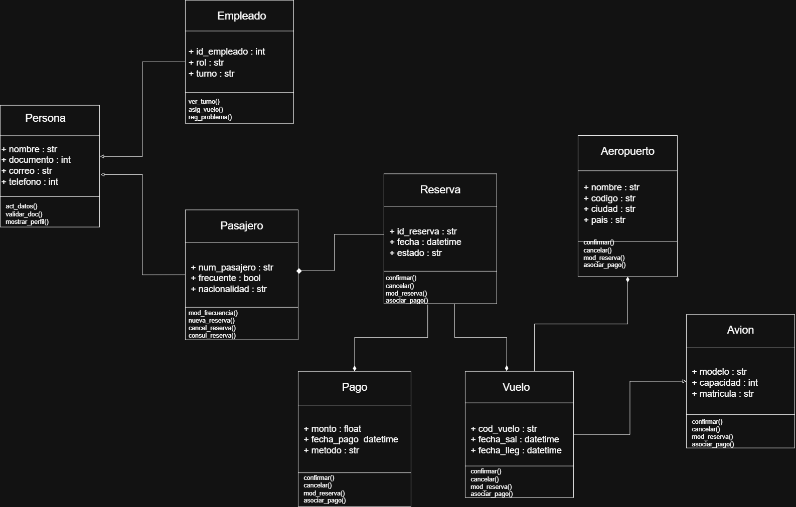

# Introducción
Este es mi primer repositorio, y lo estoy utilizando para aprender a documentar, organizar y compartir mi trabajo de forma profesional. Reúne los ejercicios y retos que he desarrollado durante mis clases de Programación Orientada a Objetos (POO) con el profesor Felipe y seguiré actualizándolo con nuevos retos a medida que avance en mi aprendizaje.
# Reto 1
En el reto 1 nos piden desarrollar una serie de ejercicios prácticos en Python, cada uno como un programa independiente. Los ejercicios incluyen operaciones matemáticas básicas entre dos números, verificación de palíndromos sin usar slicing, filtrado de números primos desde una lista, cálculo de la mayor suma entre elementos consecutivos, y detección de palabras que comparten los mismos caracteres. La idea es aplicar funciones, condicionales y lógica básica para resolver cada problema.
## 1.1
Crear una función que realice operaciones básicas (suma, resta, multiplicación, división) entre dos números, según la elección del usuario, la forma de entrada de la función será los dos operandos y el caracter usado para la operación. entrada: `(1,2,"+")`, salida `(3)`.
### Codigo
```python
print("Bienvenido, este programa te ayuda a hacer operaciones basicas.")
def operar(num_1, num_2, operador):
    if operador == "+":
        return num_1 + num_2
    elif operador == "-":
        return num_1 - num_2
    elif operador == "*":
        return num_1 * num_2
    elif operador == "/":
        if num_2 != 0:
            return num_1 / num_2
        else:
            return "No se puede dividir por 0."
    else:
        return "El operador que escribiste no es valido."
num_1 = float(input("Ingresa el primer numero (puede tener decimales): "))
num_2 = float(input("Ingresa el segundo numero (puede tener decimales): "))
operador = input("Ingresa el operador basico que quieras (+, -, *, /): ")
resultado = operar(num_1, num_2, operador)
print(resultado)


```
[Función que realiza operaciones básicas](Reto1/Reto1_1.py)
### ¿Cómo llegué al resultado
En este punto nos piden que realicemos una función donde el usuario introduzca sus propios datos, es decir, `num_1`, `num__2` y `operador`; para esto lo primero que hice fue definir la función `def operar` con sus 3 variables y para que se cumpla alguna de las tres operaciones hacer unas condicionales `if`, `elif` y `else`, que sirven para comparar y ver que operación se quiere realizar, y si se escribe un caracter diferente a los pedidos se da el error de que no ingreso uno válido. Después de esto, coloque un `input` para obtener los tres datos y un `print` para que muestre la operación al final.
## 1.2
Realice una función que permita validar si una palabra es un palíndromo. Condición: No se vale hacer slicing para invertir la palabra y verificar que sea igual a la original.
### Codigo
```python
print("Bienvenido, este programa sirve para conocer si la palabra que ingresas es un palindromo.")
def es_palindromo(palabra):
    i: int = 0
    j: int = len(palabra) - 1
    palindromo: bool = True

    while i < j:
        if palabra[i] != palabra[j]:
            palindromo = False
            break
        i += 1
        j -= 1

    return palindromo
palabra = input("Ingresa una palabra: ")
if es_palindromo(palabra):
    print("Si es un palindromo.")
else:
    print("No es un palindromo.")
```
[Función que valida si es un palíndromo](Reto1/Reto1_2.py)
### ¿Cómo llegué al resultado?
En este punto nos piden hacer una función que permita revisar si la palabra que introduzca el usuario es un palíndromo o no, para empezar ni siquiera sabia que era slicing así que no me parecio algo del otro mundo no usarlo, empece definiendo la función `def es_palindromo`, dentro de esta función hay una variable en `str` llamada `palabra`, también dos `int` que nos ayudarán luego para el ciclo que use, y por último una variable en `bool` que esta en `True`, luego de esto dos variables en `int` y una función llamada `len` que permite ver cuántos elementos hay en una secuencia. Luego de esto el ciclo `while` acompañado por un `if` nos permite recorrer el string por cada una de sus letras para asi corroborar si son iguales o no. Si son iguales la variable en `bool` sigue en `True` y nos muestra que la palabra que ingreso el usuario si es un palíndromo, y si el ciclo detecta que la palabra no es igual en alguna letra pues la variable `palabra` se convierte en `False` y nos saca del ciclo para dar el mensaje de que no es palíndromo. (Si se escribe la primera letra en mayuscula no lo toma como palíndromo).
## 1.3
Escribir una función que reciba una lista de números y devuelva solo aquellos que son primos. La función debe recibir una lista de enteros y retornar solo aquellos que sean primos.
### Codigo
```python
print("Bienvenido, este programa sirve para conocer si el numero que ingresas es un numero primo.")
numeros: str 
numeros_texto: list[str] = []
lista_numeros: list[float] = []
primos: list[int] = []

def es_primo(n: int) -> bool:
    if n < 2:
        return False
    for i in range(2, int(n**0.5) + 1):
        if n % i == 0:
            return False
    return True

def filtrar_primos(lista: list[int]) -> list[int]:
    resultado: list[int] = []
    for numero in lista:
        if es_primo(numero):
            resultado.append(numero)
    return resultado

numeros = input("Ingresa numeros separados por comas (1,2,3,4): ")
numeros_texto = numeros.split(",")
lista_numeros = [int(x.strip()) for x in numeros_texto]

primos = filtrar_primos(lista_numeros)

print("Los numeros primos son:", primos)
```
[Función que filtra los números primos](Reto1/Reto1_3.py)
### ¿Cómo llegué al resultado?
En este punto nos piden hacer una función que permita filtrar que números son primos y mostrarlos, por ende, comienzo pidiendo al usuario que ingrese varios números separados por comas. Esa entrada se guarda en la variable `numeros` que es un `str`. Luego, esa cadena se divide usando `.split(",")`, lo que genera la primera lista llamada `numeros_texto`, esta lista tiene los números aún como texto. Después, creo la segunda lista llamada `lista_numeros`, que convierte cada elemento de `numeros_texto` en un número entero. Para eso se usa la expresión `[int(x.strip()) for x in numeros_texto]`, que también se usa para eliminar los espacios innecesarios. Con esa lista de números, se define la función `def filtrar_primos`, que recorre `lista_numeros` y verifica cuáles son primos usando la función `es_primo`. Los números que cumplen esa condición se agregan a la tercera lista, llamada `primos`. Y al final, se muestra el contenido de `primos`, que serian los números ingresados por el usuario al principio ya filtrados.
## 1.4
Escribir una función que reciba una lista de números enteros y retorne la mayor suma entre dos elementos consecutivos.
### Codigo
```python
print("Bienvenido, este programa sirve para hallar la mayor suma entre dos elementos consecutivos")
numeros: str 
numeros_texto: list[str] = []
lista_numeros: list[int] = []
mayor_suma: int = 0

def mayor_suma_consecutiva(lista: list[int]) -> int:
    max_suma: int = lista[0] + lista[1]
    for i in range(1, len(lista) - 1):
        suma_actual: int = lista[i] + lista[i + 1]
        if suma_actual > max_suma:
            max_suma = suma_actual
    return max_suma

numeros = input("Ingresa numeros enteros separados por comas (1,2,3,4,): ")
numeros_texto = numeros.split(",")
lista_numeros = [int(x.strip()) for x in numeros_texto]

mayor_suma = mayor_suma_consecutiva(lista_numeros)

print("La mayor suma entre dos elementos consecutivos es:", mayor_suma)
```
[Función que realiza la mayor suma](Reto1/Reto1_4.py)
### ¿Cómo llegué al resultado?
En este punto nos piden hacer una función que permita encontrar la mayor suma entre dos números consecutivos en una lista. Para eso, empece por pedirle al usuario los datos, y luego use `split(",")` para separar los números que venían como texto. Después aplique `strip()` para limpiar espacios y `int()` para convertir cada número en entero. Ya con la lista, cree una función que recorre los elementos con un `for`, sumando cada número con el siguiente usando `lista[i] + lista[i + 1]`. Para guardar la mejor suma, use una variable llamada `max_suma` y se actualiza si encontra una suma mayor. Al final, se muestra el valor que se calcule de todo este proceso.
## 1.5
Escribir una función que reciba una lista de string y retorne unicamente aquellos elementos que tengan los mismos caracteres. e.g. entrada: `["amor", "roma", "perro"]`, salida `["amor", "roma"]`
### Codigo
```python
print("Bienvenido, este programa te ayuda a conocer palabras anagramas.")
palabras: str
palabras_texto: list[str] = []
lista_palabras: list[str] = []
resultado: list[str] = []

def filtrar_anagramas(lista: list[str]) -> list[str]:
    agrupadas: dict[str, list[str]] = {}
    for palabra in lista:
        clave: str = "".join(sorted(palabra))
        if clave in agrupadas:
            agrupadas[clave].append(palabra)
        else:
            agrupadas[clave] = [palabra]

    resultado: list[str] = []
    for grupo in agrupadas.values():
        if len(grupo) > 1:
            resultado.extend(grupo)
    return resultado

palabras = input("Ingresa palabras pero separalas por comas: ")
palabras_texto = palabras.split(",")
lista_palabras = [x.strip() for x in palabras_texto]

resultado = filtrar_anagramas(lista_palabras)

print("Las palabras con los mismos caracteres:", resultado)
```
[Función que muestra los anagramas](Reto1/Reto1_5.py)
### ¿Cómo llegué al resultado?
En este punto se quería hacer un programa que detectara palabras que son anagramas entre sí, es decir, que tienen los mismos caracteres pero en distinto orden. Primero pedí al usuario que ingresara varias palabras separadas por comas. Como esa entrada viene como texto, la separé con `.split(",")` y luego usé `strip()` para limpiar espacios. Ya con la lista de palabras lista, creé una función que agrupa las palabras según sus letras ordenadas. Para eso, tomé cada palabra, la convertí en una lista de letras, la ordené con `sorted()` y la volví a unir con `"".join()`. Esa cadena ordenada la usé como clave en un diccionario, y fui guardando ahí todas las palabras que compartían esa misma clave. Al final, revisé ese diccionario y extraje solo los grupos que tenían más de una palabra, porque eso significa que son anagramas.
# Reto 2
Elija un problema de la vida real (sistema de gestión de biblioteca, negocio de compra-venta, automóvil, etc) que se pueda modelar a través de objetos y clases. Plantee las relaciones de clases, composiciones, propiedades y comportamientos del sistema en uno mas diagramas tipo UML.
### Solución

 **Descripción**
- Las flechas vacias, significan que Empleado y Pasajero son una herencia de Persona y Vuelo es herencia de Avión.
- Los rombos, significan que a los que estan apuntando es una composición.
